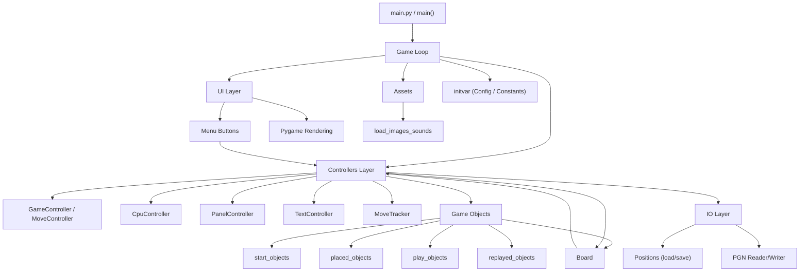

# Chess
Chess GUI is a fully interactive chess game designed for Windows users. Built entirely in Python, this application offers a rich set of features allowing players to experience the classic game of chess without the need for external chess libraries. Whether you're looking to play against the computer, challenge a friend, or simply explore chess strategies, Chess GUI provides an accessible and comprehensive platform for all your chess needs.

## Game Description
Chess GUI brings the traditional chess experience to your desktop. The game adheres to the standard rules of chess, including piece movements, checks, and checkmate scenarios, offering an authentic chess-playing experience. With its intuitive interface, players can easily interact with the game, making it suitable for chess enthusiasts of all levels.

### Key Features:
- Pure Python Implementation: Developed from scratch in Python, ensuring a lightweight and standalone chess experience without the reliance on external chess libraries.
- Standard Chess Rules: Supports all traditional chess rules, including piece-specific movements, checks, checkmates, and stalemates.
- Versatile Play Options: Engage in chess matches against the computer or opt for a human opponent, offering flexibility in gameplay.
- Move Functions: Features the ability to undo moves, providing players with the chance to correct mistakes or reconsider strategies.
- PGN Support: Offers functionalities to save and load game positions, as well as to manage Portable Game Notation (PGN) files, making it easy to review games and learn from past plays.
- Game Properties Management: Allows players to track various aspects of the game such as player names, ratings, and game results, enhancing the competitive aspect of chess.
- Board Customization: Ability to reverse the board layout for a tailored view, alongside drag-and-drop functionality for piece movement, enriches the user interaction.
- Undo Move: Integrates an undo move option to enhance gameplay flexibility, allowing players to easily revert their last move.
- Board Customization and Control:
  - Flip Board: Ability to reverse the board's perspective, catering to player preference and strategy planning.
  - Reset Board: Easily reset the game to its initial state, facilitating new strategies or starting fresh games.
  - Drag-and-Drop Movement: Enhances the user interaction with intuitive piece movement by dragging and dropping on the board.

## Demo
<p align="center">
</img>
</p>

## Technical Details

- **Programming Language**: The game is developed in Python.

### File Structure

```
Chess/
├── main.py                   # Entry point — re-exports all submodule names; async game loop
├── board.py                  # Grid squares, coordinate system
├── initvar.py                # Constants (re-exports from game/constants.py + game/ai_tables.py)
├── load_images_sounds.py     # Asset loading (sprites, sounds)
├── menu_buttons.py           # UI button sprites
├── placed_objects.py         # Piece sprites in edit mode
├── play_objects.py           # Piece sprites in play mode (with move logic)
├── replayed_objects.py       # Piece sprites in replay mode
├── start_objects.py          # Drag-tray pieces (edit mode sidebar)
├── test_smoke.py             # Headless smoke test suite (60 checks)
└── game/
    ├── constants.py          # Numeric/color constants
    ├── ai_tables.py          # CPU positional scoring tables
    ├── controllers/
    │   ├── move_tracker.py       # MoveTracker — move history & undo data
    │   ├── text_controller.py    # TextController — board coordinate labels, check text
    │   ├── cpu_controller.py     # CpuController — minimax-style CPU move selection
    │   ├── panel_controller.py   # PanelController — moves-pane rectangles & scrolling
    │   ├── switch_modes.py       # SwitchModesController (edit↔play↔replay) + GridController
    │   ├── grid_controller.py    # Re-export of GridController from switch_modes
    │   └── game_controller.py    # EditModeController, GameController, MoveController
    └── io/
        ├── positions.py          # pos_load/save_file, GameProperties, pos_lists_to_coord
        └── pgn.py                # PgnWriterAndLoader — PGN import/export
```

### Architecture Diagram



**Key design points:**
- `MoveTracker` and `TextController` are leaf nodes — they have no controller dependencies.
- `SwitchModesController` and `GridController` live in the same file (`switch_modes.py`) to avoid a circular import; each references the other directly.
- `main.py` re-exports every controller name so `test_smoke.py` and the game loop can access them as `main.MoveController`, `main.GameController`, etc. without knowing the submodule paths.


## Installation and Running the Game

### Running Locally on Your PC

If you want to run the Chess GUI on your local machine, follow these steps:

#### Prerequisites
Ensure you have Python installed on your PC. The Chess GUI is compatible with Python 3.12.1. You can download Python from [python.org](https://www.python.org/downloads/).

#### Clone the Repository
Clone the Chess repository from GitHub to your local machine:
```git clone https://github.com/bradwyatt/Chess.git```

#### Install Dependencies
Navigate to the cloned repository directory and install the required dependencies:
```
cd Chess
pip install -r requirements.txt
```
This will install all the necessary Python packages listed in `requirements.txt`.

#### Run the Game
Finally, run the game using Python:
```
python main.py
```

Now you're all set to enjoy the Chess GUI game on your PC!


## Collaboration and Contributions

I warmly welcome contributions to the Chess GUI and am open to collaboration. Whether you have suggestions for improvements, bug fixes, or new features, please feel free to open an issue or submit a pull request on GitHub.

Additionally, I'm eager to collaborate with other developers and enthusiasts. If you're interested in working together to expand features, optimize code, brainstorm new game ideas, or even embark on new projects, I'd be delighted to hear from you. 

For contributions to the Chess GUI:
- Open an issue or submit a pull request on GitHub repository: [Chess](https://github.com/bradwyatt/Chess)

For collaboration and more detailed discussions:
- Contact me at **GitHub**: [bradwyatt](https://github.com/bradwyatt)


---

## 2026 Refactoring & Optimization with Claude AI

In early 2026, the codebase underwent a comprehensive refactoring effort assisted by [Claude](https://claude.ai) (Anthropic's AI). The motivation was to lay a clean foundation for future improvements and to prepare the project for a potential release on [itch.io](https://itch.io). The goals were to improve maintainability, reduce duplication, and optimize performance — without altering any game behavior.

### Summary of Impact

- **Before**: A single monolithic `main.py` (~2,200 lines) with significant class duplication, repeated color-branching logic, and linear-time lookups throughout.
- **After**: A modular architecture across focused files, a clean controller layer, O(1) piece lookups, and a unified asset-loading system.
