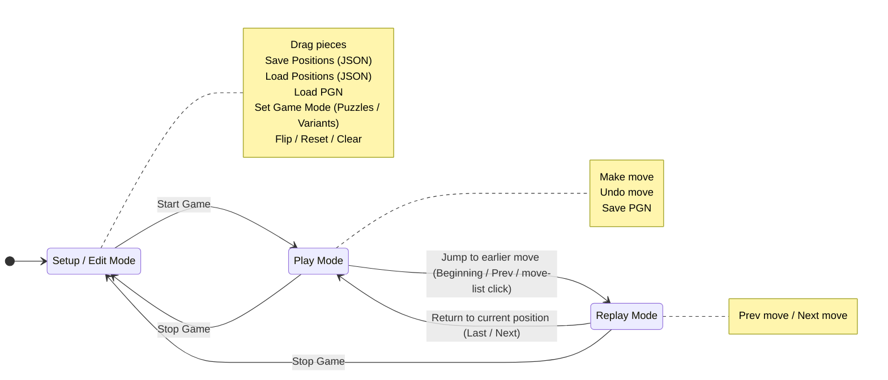
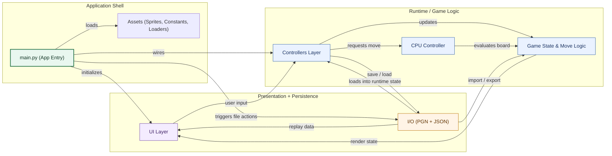

# Chess

Desktop chess GUI written in Python with `pygame`. The project implements gameplay, move validation, PGN import/export, position editing, replay controls, and a small library of built-in puzzles and variants without depending on an external chess engine library.

## Highlights

- Play in `Human vs Human`, `Play as White vs CPU`, or `Play as Black vs CPU`.
- Use edit mode to drag pieces onto the board and create custom study positions.
- Save and load board positions as JSON.
- Save and load full games as PGN.
- Browse built-in game modes, including mate puzzles and chess variants.
- Step through replayed games with move navigation controls.
- Undo moves during live play.
- Flip the board and automatically orient it so the human side stays on the bottom in CPU games.

## Built-in Game Modes

The `Game Modes` sidebar groups presets into `Puzzles` and `Variants`.

### Puzzles

- `Mate in 1`
- `Mate in 2`
- `Mate in 3`
- `Mate in 4`

The bundled mate positions load curated study setups from [`chess_positions/`](./chess_positions).

### Variants

- `Pawns Only`: Standard pawn lines with only the two kings left on the back rank (`e1` and `e8`).
- `Random Setup`: A Chess960-style start where each side keeps its full pawn line, but the back-rank pieces are reshuffled into a legal randomized layout.
- `Chaos Setup`: Each side keeps its pawns on the usual second and seventh ranks, but the back rank is filled from a randomized mix of queens, rooks, bishops, knights, and one king. Castling is disabled in this mode.
- `Peasant's Revolt`: White starts with a king and eight pawns against Black's king, three knights, and a single pawn.
- `Charge of the Light Brigade`: White starts with a king, eight pawns, and three queens against Black's king, eight pawns, and seven knights.

When a library mode is active, its title is shown beneath the board until you change the setup, clear the board, or load another position or PGN.

## Demo


## Requirements

- Python `3.11+`
- A local environment with the packages from [`requirements.txt`](./requirements.txt)

Current Python dependencies:

- `pygame`
- `PySimpleGUI`
- `numpy`
- `pandas`
- `pygbag`

## Getting Started

Clone the repo and install the dependencies:

```bash
git clone https://github.com/bradwyatt/Chess.git
cd Chess
python3 -m pip install -r requirements.txt
```

Run the game:

```bash
python3 main.py
```

If your machine exposes `python` instead of `python3`, that works too, but `python3` is the safer command on macOS and Linux.

## How To Use



### Setup Mode

Setup mode is where you prepare a board before starting play.

- Drag pieces from the sidebar tray onto the board.
- Set a game mode from `Game Modes` (`Puzzles` / `Variants`).
- Choose the game mode selector: white vs CPU, black vs CPU, or human vs human.
- Choose the starting side to move when saving a custom position.
- Use `Flip Board`, `Reset Board`, or `Clear Board` to adjust the setup.
- Save positions as JSON from the file actions panel.
- Load positions JSON from the file actions panel.
- Load a PGN file from the file actions panel.

Press `Start Game` to switch from setup mode into play mode.

### Play Mode

- Drag and drop pieces to make moves.
- Use `Undo Move` to revert the last move.
- Save the current game as PGN.
- Use replay navigation buttons to move through recorded games.

### Sample PGNs

Bundled sample games live in [`pgn_sample_games/`](./pgn_sample_games).

The current repository includes:

- `Carlsen vs Kasparov (2004)`
- `De los Santos vs Polgar (1990)`
- `Deep Blue vs Garry Kasparov (1996)`

## Testing

Run the headless smoke suite:

```bash
python3 test_smoke.py
```

Run the visual smoke test:

```bash
python3 visual_test.py
```

Notes:

- `test_smoke.py` sets SDL dummy drivers so it can run without opening a window.
- Both test scripts still require the project dependencies to be installed first.

## Position JSON Format

Saved positions and bundled game-mode files use JSON with separate metadata and board state:

```json
{
  "game_mode": "Play as White vs CPU",
  "board_orientation": "White on Bottom",
  "starting_turn": "white",
  "pieces": {
    "white_pawn": ["f5", "f3"],
    "white_bishop": ["d3"],
    "white_knight": [],
    "white_rook": ["e1"],
    "white_queen": ["f7"],
    "white_king": ["h1"],
    "black_pawn": ["d6"],
    "black_bishop": ["b7"],
    "black_knight": ["g8"],
    "black_rook": ["a8"],
    "black_queen": ["d4"],
    "black_king": ["h8"]
  }
}
```

Metadata fields:

- `game_mode`: `Play as White vs CPU`, `Play as Black vs CPU`, or `Human vs Human`
- `board_orientation`: `White on Bottom` or `Black on Bottom`
- `starting_turn`: `white` or `black`

Older flat JSON payloads are still accepted when loading, but newly saved files use the nested `pieces` schema.

## Browser / Itch Notes

The codebase includes browser-oriented paths for `pygbag` / `emscripten`, but desktop is still the primary experience.

In browser mode:

- Native file dialogs are unavailable.
- Saving and loading custom positions is disabled.
- Saving and loading PGN is disabled.
- Some UI messaging recommends landscape mode for itch.io.

## Project Layout

```text
Chess/
├── main.py
├── board.py
├── load_images_sounds.py
├── menu_buttons.py
├── placed_objects.py
├── play_objects.py
├── replayed_objects.py
├── start_objects.py
├── test_smoke.py
├── visual_test.py
├── chess_positions/
├── pgn_sample_games/
├── sprites/
└── game/
    ├── constants.py
    ├── ai_tables.py
    ├── controllers/
    │   ├── cpu_controller.py
    │   ├── game_controller.py
    │   ├── grid_controller.py
    │   ├── move_tracker.py
    │   ├── panel_controller.py
    │   ├── switch_modes.py
    │   └── text_controller.py
    └── io/
        ├── pgn.py
        └── positions.py
```

## Architecture Notes



- [`main.py`](./main.py) is the application entry point and re-exports controller classes for backward compatibility.
- [`game/controllers/game_controller.py`](./game/controllers/game_controller.py) contains the main gameplay and move execution flow.
- [`game/controllers/cpu_controller.py`](./game/controllers/cpu_controller.py) handles CPU move selection.
- [`game/controllers/switch_modes.py`](./game/controllers/switch_modes.py) holds both `SwitchModesController` and `GridController` to avoid a circular import.
- [`game/io/positions.py`](./game/io/positions.py) manages JSON position serialization and loading.
- [`game/io/pgn.py`](./game/io/pgn.py) manages PGN import and export.

## Refactoring Note

The original project began as a much larger monolithic `main.py`. The 2026 refactor split gameplay, UI, and I/O responsibilities into focused modules under [`game/controllers/`](./game/controllers) and [`game/io/`](./game/io) without changing the core user-facing behavior.

## Contributing

Issues and pull requests are welcome at the GitHub repository:

- https://github.com/bradwyatt/Chess

If you want to collaborate directly, the project owner is also on GitHub:

- https://github.com/bradwyatt
