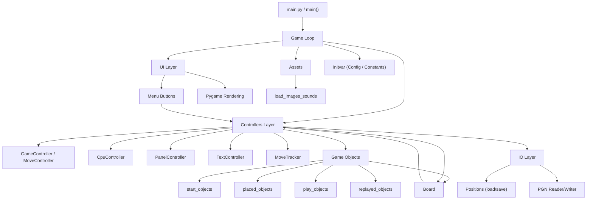

# Chess
Chess GUI is a fully interactive chess game built entirely in Python. It offers a rich set of features allowing players to experience the classic game of chess without the need for external chess libraries. Whether you're looking to play against the computer, challenge a friend, or simply explore chess strategies, Chess GUI provides an accessible and comprehensive platform for all your chess needs.

## Game Description
Chess GUI brings the traditional chess experience to your desktop. The game adheres to the standard rules of chess, including piece movements, checks, and checkmate scenarios, offering an authentic chess-playing experience. With its intuitive interface, players can easily interact with the game, making it suitable for chess enthusiasts of all levels.

### Key Features:
- **Pure Python Implementation**: Developed from scratch in Python, ensuring a lightweight and standalone chess experience without the reliance on external chess libraries.
- **Standard Chess Rules**: Supports all traditional chess rules, including piece-specific movements, checks, checkmates, and stalemates.
- **Versatile Play Options**: Engage in chess matches against the computer or opt for a human opponent, offering flexibility in gameplay.
- **Undo Move**: Revert the last move to correct mistakes or reconsider strategies.
- **PGN Support**: Save and load game positions and manage Portable Game Notation (PGN) files, making it easy to review games and learn from past plays.
- **Game Properties Management**: Track player names, ratings, and game results, enhancing the competitive aspect of chess.
- **Board Editor**: Set up any custom position by dragging pieces from the sidebar onto the board — useful for studying endgames or specific scenarios.
- **Board Customization**:
  - Flip Board: Reverse the board's perspective to suit player preference.
  - Reset Board: Easily reset the game to its initial state.
  - Drag-and-Drop Movement: Intuitive piece movement by dragging and dropping on the board.

## Demo
<p align="center">
</img>
</p>

## Technical Details

- **Programming Language**: Python 3.11+
- **Key Dependencies**: pygame, PySimpleGUI, pygbag (web export), numpy, pandas

### File Structure

```
Chess/
├── main.py                   # Entry point — re-exports all submodule names; async game loop
├── board.py                  # Grid squares, coordinate system
├── info_screen.py            # Info/about screen UI
├── initvar.py                # Constants (re-exports from game/constants.py + game/ai_tables.py)
├── load_images_sounds.py     # Asset loading (sprites, sounds)
├── menu_buttons.py           # UI button sprites
├── placed_objects.py         # Piece sprites in edit mode
├── play_objects.py           # Piece sprites in play mode (with move logic)
├── replayed_objects.py       # Piece sprites in replay mode
├── start_objects.py          # Drag-tray pieces (edit mode sidebar)
├── test_smoke.py             # Headless smoke test suite (60 checks)
└── game/
    ├── constants.py          # Numeric/color constants
    ├── ai_tables.py          # CPU positional scoring tables
    ├── controllers/
    │   ├── move_tracker.py       # MoveTracker — move history & undo data
    │   ├── text_controller.py    # TextController — board coordinate labels, check text
    │   ├── cpu_controller.py     # CpuController — minimax-style CPU move selection
    │   ├── panel_controller.py   # PanelController — moves-pane rectangles & scrolling
    │   ├── switch_modes.py       # SwitchModesController (edit↔play↔replay) + GridController
    │   ├── grid_controller.py    # Re-export of GridController from switch_modes
    │   └── game_controller.py    # EditModeController, GameController, MoveController
    └── io/
        ├── positions.py          # pos_load/save_file, GameProperties, pos_lists_to_coord
        └── pgn.py                # PgnWriterAndLoader — PGN import/export
```

### Architecture Diagram



**Key design points:**
- `MoveTracker` and `TextController` are leaf nodes — they have no controller dependencies.
- `SwitchModesController` and `GridController` live in the same file (`switch_modes.py`) to avoid a circular import; each references the other directly.
- `main.py` re-exports every controller name so `test_smoke.py` and the game loop can access them as `main.MoveController`, `main.GameController`, etc. without knowing the submodule paths.


## Installation and Running the Game

### Running Locally on Your PC

If you want to run the Chess GUI on your local machine, follow these steps:

#### Prerequisites
Ensure you have Python 3.11 or later installed. You can download Python from [python.org](https://www.python.org/downloads/).

#### Clone the Repository
Clone the Chess repository from GitHub to your local machine:
```git clone https://github.com/bradwyatt/Chess.git```

#### Install Dependencies
Navigate to the cloned repository directory and install the required dependencies:
```
cd Chess
pip install -r requirements.txt
```
This will install all the necessary Python packages listed in `requirements.txt`.

#### Run the Game
Finally, run the game using Python:
```
python main.py
```

Now you're all set to enjoy the Chess GUI game on your PC!


## Collaboration and Contributions

I warmly welcome contributions to the Chess GUI and am open to collaboration. Whether you have suggestions for improvements, bug fixes, or new features, please feel free to open an issue or submit a pull request on GitHub.

Additionally, I'm eager to collaborate with other developers and enthusiasts. If you're interested in working together to expand features, optimize code, brainstorm new game ideas, or even embark on new projects, I'd be delighted to hear from you. 

For contributions to the Chess GUI:
- Open an issue or submit a pull request on GitHub repository: [Chess](https://github.com/bradwyatt/Chess)

For collaboration and more detailed discussions:
- Contact me at **GitHub**: [bradwyatt](https://github.com/bradwyatt)


---

## 2026 Refactoring

The codebase I originally wrote had grown into a single 2,200-line `main.py` — functional, but hard to extend. In early 2026, I used [Claude](https://claude.ai) as a refactoring assistant to work through a structured cleanup across 8 phases, with a strict constraint of no behavior changes throughout.

### What changed

| Area | Before | After |
|------|--------|-------|
| Structure | Monolithic `main.py` (~2,200 lines) | Focused modules under `game/controllers/` and `game/io/` |
| Piece lookups | O(n) grid scan on every move | O(1) dict-based lookup |
| Color branching | Duplicated if/else per controller | Unified per-color dispatch |
| Asset loading | 36 explicit `load_image` calls | Loop-driven from a single mapping |
| Test coverage | None | 60-check headless smoke suite (`test_smoke.py`) |
